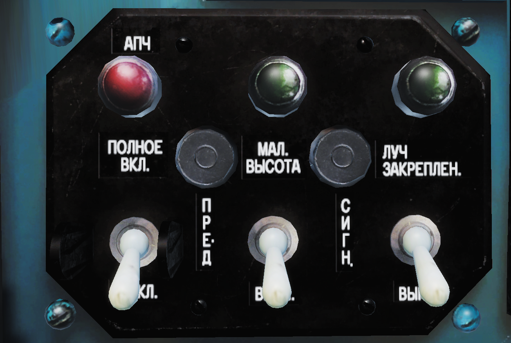
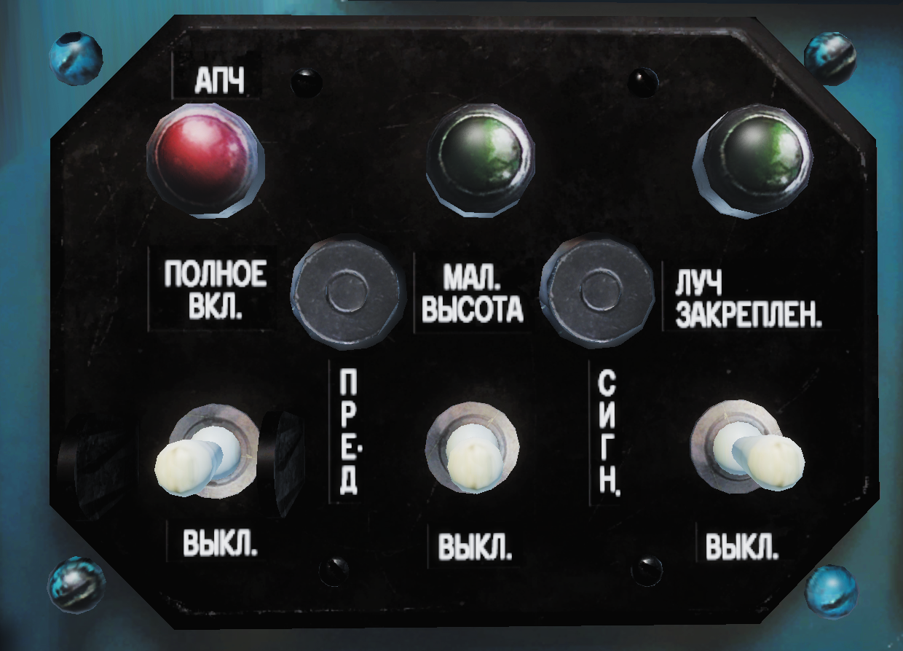
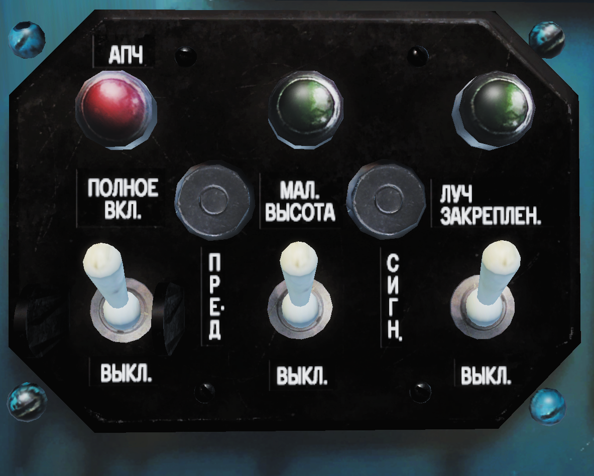
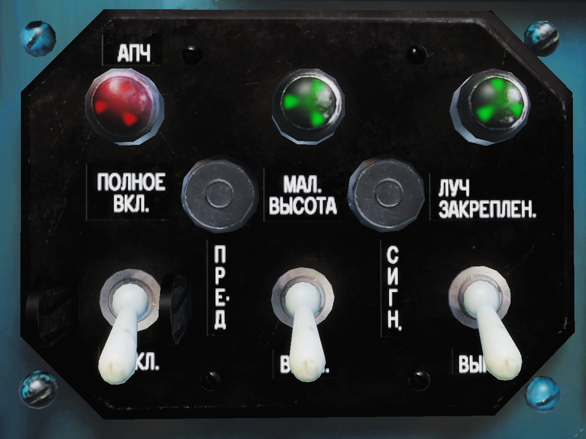
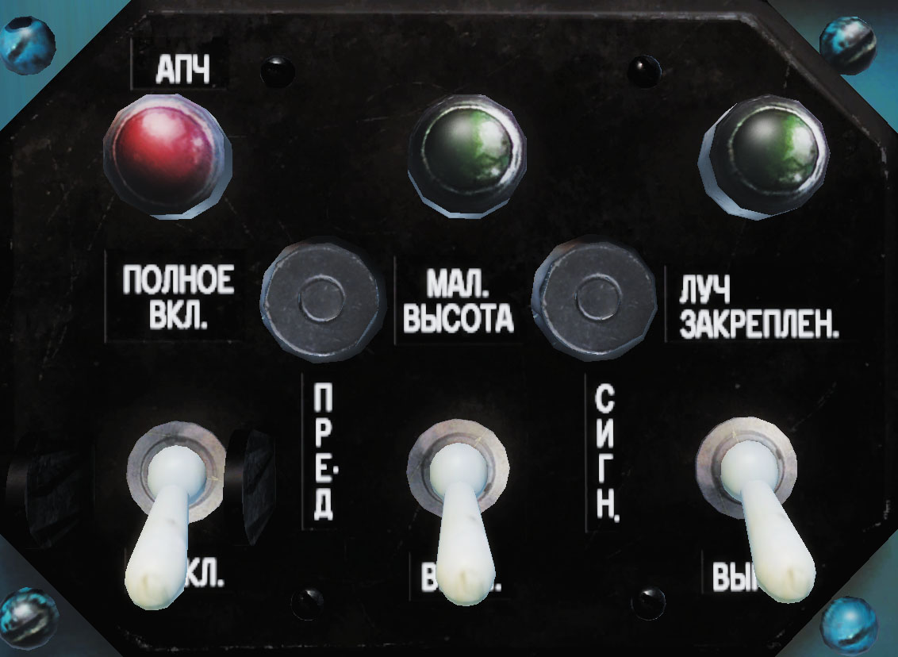
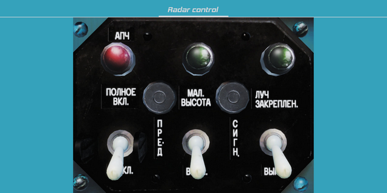
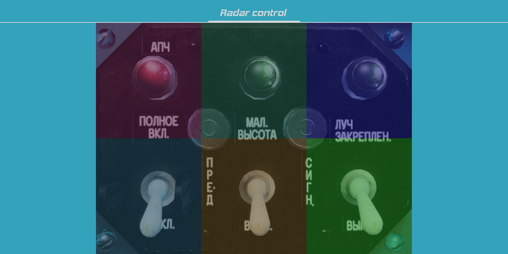
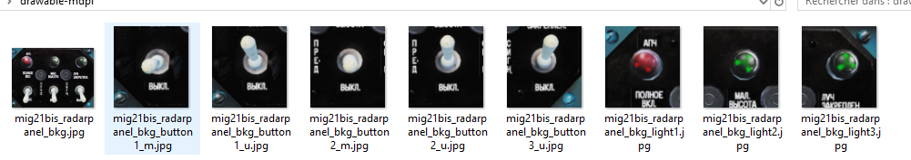

# How to add a panel to Cockpit++ (Android)

This guide is made to explain how to implement a panel for Cockpit++.

To illustrate this guide I'm developping the radar management panel of the Mig-21.

**Requirements:**
- DCS with the module of the panel you want to develop
- An Android device (minimum 4.4)
- Android Studio
- Notepad++
- Basics of Android programmation (Activity, Fragment and Broadcast)
- Basics of Git (branch, merge, pullRequest, ...)


**Guidelines:**
- No Framework
- 1 panel = 1 view or 1 fragment ==> to be managed/resized easely in an fragment/activity
- Every panels are implemented on the same way (structures, names, ...), try to continue on the same way, it will make the app easier to understand for beginners comparing different panels
- 1 panel = 1 branch for Git
- panel must keep the good proportion after rotation of the phone and on different sizes of phone (you can use emulator for that ;) )


## LUA part
In this chapter you will work in the ***Cockpit++.lua*** to create your interface between DCS and your app, you will learn:
- how to identify the panel's commands
- how to send data to the game
- how to get data from the game

### Identify the panel in the code and IDs
First you need to go in the folder of the module: *D:\yourPathToDCS\Mods\aircraft\MIG-21bis\Cockpit*
We will focus on three files:
- ***devices.lua***, which contains all the key to get the panel when the game is running, those keys must be added in a new class dedicated for that, here it will be : ***MiG-21Bis_Devices.java*** but don't do it for now, Keep these values saved somewhere, you will use them in the **Android part (Interaction)**
- ***clickabledata.lua*** and ***mainpanel_init.lua***, you will find here the IDs to get values, they will be used in the ***Cockpit++.lua*** to transfer their values to the phone, first is for buttons, second for light (at least for the Mig21)
- ***command_defs.lua***, here you will get the IDs to make an action on an element in the cockpit.

### Send actions (data) to DCS
You identified where to find the IDs to interact with DCS, let's now find the exact IDs you need for the panel you are developing.

In my example, I need to get the IDs for the radar panel, so I search radar's IDs in ***command_defs.lua***, I search "radar" and find:
```lua
RADARon = start_command + 94;
RADARlowAlt = start_command + 95;
RADARfixBeam = start_command + 96;
```
**start_command** being a constant = 3000.
I also need to find the correct ID of the panel, I will find that in ***devices.lua***.

For the radar, it seems to be 44.

To check if these ID are working well, you can use the current version of Cockpit++, go in Settings, and in the SandBox enter:
```
Code : 3094
Device : 44 
Type : 1 
Value : 1 (or 0 if it is already on 1)
```
After started DCS, run a mission and when you are in your plane click "**Send!**" and... it's not working... yeah, it happens! it means I don't have the correct IDs, I need to check for the code and for the device.

In this case the code was correct, so I checked all IDs in Device (from 0 to 60+ for the Mig21), and the button in the game moved with the Device ID: 40, which is related to: UUA (and not RADAR...)

So now you can interact with this button:
```
Code : 3094
Device : 40
Type : 1 
Value : 1 (or 0 if it is already on 1)
```
At this moment you can also play with other buttons to get all the IDs you will need for the panel.

For the Mig-21's radar management panel I will need **3094(on/prep/off button)**, **3095(low button)** and **3096(Beam button)**

Keep these values saved somewhere, you will use them in the **Android part (Interaction)**

### get data from the game
For this part we will work in the .lua, I will add the block after the other blocks for other modules
```lua
elseif currentAircraft == "MiG-21Bis" and GetDevice(0) ~= 0 then
	--TODO
```
Entering in this block means you are currently using the MiG-21Bis in the game, so you can get data from the plane.

First, you need to get your device, for most of module, most of plane, it will be the same : 
```lua
local MainPanel = GetDevice(0)
```
it will change if you have a list of value (list_indication(7) for the Mirage to get what is written of the PCA for example)

Coming back to our MiG-21Bis, now you have you device and you want get value of buttons of the panel, you will have to make:
```lua
MainPanel:get_argument_value(ID)
```
ID will be find in ***clickabledata.lua***, you are looking for something related to radar/lowAlt/Beam, let's find them! After some researchs I found:
```lua
elements["PNT_205"] = multiposition_switch_limited(_("Radar Off/Prep/On"),devices.RADAR, device_commands.RADARon,205,3, 0.5,true)
elements["PNT_206"] = multiposition_switch_limited(_("Low Altitude Off/Comp/On"),devices.RADAR, device_commands.RADARlowAlt,206,3, 0.5,true) 
elements["PNT_207"] = default_2_position_tumb(_("Locked Beam On/Off"),devices.RADAR, device_commands.RADARfixBeam,207)
```
so ID of my buttons to get their positions will be 205, 206 and 207.

I will find the IDs for the lights in ***mainpanel_init.lua***, I made a search on "beam" and I found:
```lua
RADAR_ERROR = CreateGauge("parameter")
RADAR_ERROR.parameter_name = "RADAR_ERROR"
RADAR_ERROR.arg_number = 553
RADAR_ERROR.input = { 0.0, 1.0 }
RADAR_ERROR.output = { 0.0, 1.0 }

RADAR_LOW_ALT = CreateGauge("parameter")
RADAR_LOW_ALT.parameter_name = "RADAR_LOW_ALT"
RADAR_LOW_ALT.arg_number = 554
RADAR_LOW_ALT.input = { 0.0, 1.0 }
RADAR_LOW_ALT.output = { 0.0, 1.0 }

RADAR_FIX_BEAM = CreateGauge("parameter")
RADAR_FIX_BEAM.parameter_name = "RADAR_FIX_BEAM"
RADAR_FIX_BEAM.arg_number = 555
RADAR_FIX_BEAM.input = { 0.0, 1.0 }
RADAR_FIX_BEAM.output = { 0.0, 1.0 }
```
so ID of the lights are 553, 554 and 555.

so... let's add them in the ***Cockpit++.lua***:
```lua
msgOut = msgOut..MainPanel:get_argument_value(205) ..";".. MainPanel:get_argument_value(206) ..";".. MainPanel:get_argument_value(207) ..";".. MainPanel:get_argument_value(553) ..";".. MainPanel:get_argument_value(554) ..";".. MainPanel:get_argument_value(555) ..",".." \n"
```
msgOut will be the object sent to the phone, you have to be careful with the ";" and the ",", they are used as separator and have a clear signification:
- ";" used to separated values for a same panel
- "," used to separated value for a different panel(or part of the panel)
When you are not sure about values, you can check them, let's use a logger and see how look the values, for that I will write:
```lua
log_file:write("\n")
log_file:write("ID-")
log_file:write(MainPanel:get_argument_value(ID))
```
in case of a list, you can make:
```lua
log_file:write("\n")
log_file:write("ID-")
log_file:write(list_indication(ID))
```
After you need to start the game (the LUA can be edited and saved only when the game is off, at least in the menu), select a mission, start it, remove the pause, select your plane, manipulate your buttons some seconds and you can already leave the mission and go back to the menu. You will see your logger will be soooo full! For that you need to go in *C:\Users\yourWonderfulNickName\Saved Games\DCS\Logs\Cockpit++_Logger.log*, open it and find which value are moving properly according your actions in the cockpit.

Sometimes the IDs are not exactly the one you expect, so you will have to repeat that until you identified every IDs you need to for your panel.

Remember to remove the Log_file when you finish, or you have a problem of memory and DCS will crash (I know what I'm talking about...)

So, for the radarPanel of the MiG-21Bis, you should have this:
```lua
elseif currentAircraft == "MiG-21Bis" and GetDevice(0) ~= 0 then
    local MainPanel = GetDevice(0)
    radarPanel = MainPanel:get_argument_value(205) ..";".. MainPanel:get_argument_value(206) ..";".. MainPanel:get_argument_value(207) ..";".. MainPanel:get_argument_value(553) ..";".. MainPanel:get_argument_value(554) ..";".. MainPanel:get_argument_value(555)
    msgOut = msgOut.. radarPanel ..",".." \n"
```
Now your DCS is sending on the network the data related to the information of the panel.


## Android part (New panel)
You cloned the Android project and you already created your branch for your panel, what now?
- You will create the Activity of the plane if it is not existing (With the PageViewer)
- You will edit the menu if necessary to access to this Activity
- You will create the Fragment which contains the panel

### Create activity
This part is pointless if an activity is already existing for the module, remember, 1 activity = 1 module ;)

If it is for a new module, nothing very big here, you copy/paste an existing activity and modify(rightClick => refactor => rename) to have something neat for your module:

***ModuleName_Activity.java***

***ModuleName_PagerAdapter.java***

***activity_modulename.xml***

For the MiG21Bis, it gives:
```java
public class MiG21Bis_Activity extends Module_Activity {

    @Override
    protected void onCreate(Bundle savedInstanceState) {
        super.onCreate(savedInstanceState);

        //Bind the view
        setContentView(R.layout.activity_mig21bis);

        //Load the fragments in the viewPager
        MiG21Bis_PagerAdapter pagerAdapter = new MiG21Bis_PagerAdapter(getSupportFragmentManager(),new String[] { getString(R.string.mig21bis_radar_control_panel) + " "});
        ViewPager viewPager = (ViewPager) findViewById(R.id.viewpager);
        viewPager.setAdapter(pagerAdapter);

        //Add the font in the titles of each panel
        Typeface fontTypeFace= Typeface.createFromAsset(getAssets(),"fonts/hemi_head_bd_it.ttf");
        PagerTabStrip pagerTabStrip = (PagerTabStrip) findViewById(R.id.pagerTabStrip);
        for (int i = 0; i < pagerTabStrip.getChildCount(); ++i) {
            View nextChild = pagerTabStrip.getChildAt(i);
            if (nextChild instanceof TextView) {
                TextView textViewToConvert = (TextView) nextChild;
                textViewToConvert.setTypeface(fontTypeFace);
            }
        }
    }

    @Override
    protected void onResume() {
        super.onResume();
        setCurrentAircraft(getString(R.string.mig21bis));//Tells to Module_Activity what module the user is using
    }
}
```

The adapter will be used to slide panel to panel, it's very important to use it, event if for now you have only one panel. ;)

To test if the activity working, let another random panel inside.

You should have something like that:

```java
public class MiG21Bis_PagerAdapter extends FragmentPagerAdapter {

    private String tabtitles[];

    public MiG21Bis_PagerAdapter(FragmentManager fm, String pTabtitles[]) {
        super(fm);
        tabtitles = pTabtitles;
    }

    @Override
    public int getCount() {
        return tabtitles.length;
    }

    @Override
    public Fragment getItem(int position) {
        Fragment fragment;
        switch (position) {
            case 0:
                fragment = new A10C_VVI();//MiG21Bis_RadarControl();
                break;
            default:
                fragment = new A10C_VVI();//MiG21Bis_RadarControl();

        }
        return fragment;
    }

    @Override
    public CharSequence getPageTitle(int position) {
        return tabtitles[position];
    }
}
```

Remember to declare the activity in the manifest:
```xml
<activity
            android:name="fr.astazou.cockpitplusplus.activities.MiG21Bis_Activity"
            android:configChanges="keyboardHidden|orientation|screenSize"
            android:theme="@style/AppTheme" />
```
To finish, just add the proper colors of the module (cockpit's theme), the proper Strings and... 


### Access to this activity
(again pointless if you the activity was already existing)

Before testing if it is working, we need to go in ***activity_menu.xml*** to change the color of the button (to show it is not disabled), and after we need to go in ***Menu_Activity.java***, to change that:
```java
mig21.setOnClickListener(new View.OnClickListener() {
            @Override
            public void onClick(View v) {
                showToast(R.string.not_available);
            }
        });
```
by that:
```java
mig21.setOnClickListener(new View.OnClickListener() {
            @Override
            public void onClick(View v) {
                Intent intent = new Intent(Menu_Activity.this, MiG21Bis_Activity.class);
                startActivity(intent);
            }
        });
```

Also remember to go in ***Module_Activity.java*** to add you new activity, it will make auto-redirection if the user is changing module in the game ;)

For the MiG-21Bis I need to put:
```java
case "MiG-21Bis":
	Toast.makeText(this, getString(R.string.wrong_module_1) + " " + pWrongModule + getString(R.string.wrong_module_2bis) ,Toast.LENGTH_LONG).show();
	startActivity(new Intent(Module_Activity.this, MiG21Bis_Activity.class));
	break;
```
Then you can run your app', you should be able to click on the button and access to your activity (with a randon panel for now, but just needed to check the new activity is working ;) ).


### Create the Fragment of your panel
Now you have your Activity, your PageAdapter, let's create the Fragment now!

The fragment can be resized/managed/moved as we want, that's why it's quite important to use it.

I copy past an existing fragment and I do some cleaning in it:
```java
public class ModuleName_RadarControl extends Fragment
```
Basic very important method to not delete are : 
- ModuleName_RadarControl()
- onCreate(Bundle savedInstanceState)
- onCreateView(LayoutInflater inflater, ViewGroup container,Bundle savedInstanceState)
- sendCommand(ModuleName_Commands pCommand)
- sendCommand(ModuleName_Commands pCommand, String pValue)
- onResume()
- onConfigurationChanged(Configuration newConfig)
- resizeView()
- onDestroy()

I invite you to check to code directly to understand who is working this class for the **MiG21Bis_RadarControl** fragment. I added directly comments ;)


If you create a panel for an existing module, the **ModuleName_Commands** is probably already existing, so you don't need to create it.

But if you create a panel for a new module, you need to create the **ModuleName_Commands** (**Mig21Bis_Commands** for the Mig21).


## Android part (View)

Welcome in the longest part, the view!

We will make screenshots of the panel with buttons in every positions.

First screenshot will show all the panel with buttons in default position and will be the background of your panel.

All the rest will be pieces of screenshots we will place over the background view to show to the user the position of the buttons.

So how to make screenshots?

Just follow this post: [https://forums.eagle.ru/showpost.php?p=3224879&postcount=2](https://forums.eagle.ru/showpost.php?p=3224879&postcount=2) maybe now you can use ***ModelViewer2.exe*** instead of ***ModelViewer.exe***

You will ask me "*why don't do screens in the game?*", because it's not so easy to have the exact position of the camera in front of the panel, and it's easier to manage button positions starting animations.

So for the Mig21, I made pictures of the radar panel using animations to have every positions of button, and of course, lights.
It is **very important** to not move the camera when you do the screens!

This first image is the "default background" image of the panel, the other images will be cut to put some images over the background image, this is how we will show the different positions of the buttons/lights.





for now, we have to cut the images, and make them to have to exact same position, and yes, I use the layers for that ;)
when I setted the positions, I export the background as jpg, I have now ***mig21bis_radarpanel_bkg.jpg*** that I will put in *..\CockpitPP\app\src\main\res\drawable-mdpi*

I will also notice I removed the useless border to have a perfect and logical fit in the screen

I will call it in the ***fragment_mig21bis_radarcontrol.xml***
```xml
<FrameLayout xmlns:android="http://schemas.android.com/apk/res/android"
    xmlns:tools="http://schemas.android.com/tools"
    android:layout_width="match_parent"
    android:layout_height="match_parent"
    tools:ignore="MissingPrefix"
    tools:context="fr.astazou.cockpitplusplus.fragments.UH1H_Armament">

    <ImageView
        android:id="@+id/layout"
        android:layout_width="wrap_content"
        android:layout_height="wrap_content"
        android:layout_gravity="center"
        android:src="@drawable/mig21bis_radarpanel_bkg"
        android:adjustViewBounds="true"
        android:scaleType="fitXY"
        android:contentDescription="@null"/>

    <LinearLayout
        android:id="@+id/container"
        android:layout_width="match_parent"
        android:layout_height="match_parent"
        android:orientation="vertical"
        android:layout_gravity="center_vertical"
        android:gravity="center"
        android:weightSum="2">

        <!-- TODO: Here we will add the buttons/images in the view -->

    </LinearLayout>

</FrameLayout>
```

if you start your app, you will see that:


now will add the layout/cells over the background, in the "container" part, this container will handle buttons and lights. It will be very important with these layouts to to keep the same proportions, what ever the rotation of the screen or the size of the screen.

It means you have to use **weight** attribute or similar.

Doing that, I strongly recommend to add colors at each layout, why? Because it will be very helpful for you to cut exactly the pieces of images you will need for the different positions of the buttons/lights.

It gives me something like that:



Here is the code to show how I did:
```xml
<FrameLayout xmlns:android="http://schemas.android.com/apk/res/android"
    xmlns:tools="http://schemas.android.com/tools"
    android:layout_width="match_parent"
    android:layout_height="match_parent"
    tools:ignore="MissingPrefix"
    tools:context="fr.astazou.cockpitplusplus.fragments.UH1H_Armament">

    <ImageView
        android:id="@+id/layout"
        android:layout_width="wrap_content"
        android:layout_height="wrap_content"
        android:layout_gravity="center"
        android:src="@drawable/mig21bis_radarpanel_bkg"
        android:adjustViewBounds="true"
        android:scaleType="fitXY"
        android:contentDescription="@null"/>

    <LinearLayout
        android:id="@+id/container"
        android:layout_width="match_parent"
        android:layout_height="match_parent"
        android:orientation="vertical"
        android:layout_gravity="center_vertical"
        android:gravity="center"
        android:weightSum="2">

        <LinearLayout
            android:layout_width="match_parent"
            android:layout_height="0dp"
            android:layout_weight="1"
            android:orientation="horizontal"
            android:background="#5228"
            android:weightSum="3">

            <RelativeLayout
                android:layout_width="0dp"
                android:layout_height="match_parent"
                android:layout_weight="1"
                android:background="#5822">
                <!-- TODO : light images-->
            </RelativeLayout>

            <RelativeLayout
                android:layout_width="0dp"
                android:layout_height="match_parent"
                android:layout_weight="1"
                android:background="#5282">
                <!-- TODO : light images-->
            </RelativeLayout>

            <RelativeLayout
                android:layout_width="0dp"
                android:layout_height="match_parent"
                android:layout_weight="1"
                android:background="#5228">
                <!-- TODO : light images-->
            </RelativeLayout>

        </LinearLayout>

        <LinearLayout
            android:layout_width="match_parent"
            android:layout_height="0dp"
            android:layout_weight="1"
            android:orientation="horizontal"
            android:background="#5282"
            android:weightSum="3">

            <RelativeLayout
                android:layout_width="0dp"
                android:layout_height="match_parent"
                android:layout_weight="1"
                android:background="#5228">
                <!-- TODO : buttons images-->
            </RelativeLayout>

            <RelativeLayout
                android:layout_width="0dp"
                android:layout_height="match_parent"
                android:layout_weight="1"
                android:background="#5822">
                <!-- TODO : buttons images-->
            </RelativeLayout>

            <RelativeLayout
                android:layout_width="0dp"
                android:layout_height="match_parent"
                android:layout_weight="1"
                android:background="#5282">
                <!-- TODO : buttons images-->
            </RelativeLayout>

        </LinearLayout>

    </LinearLayout>

</FrameLayout>
```

Now I'm making a screenshot of this view, I import it in a new layer (in photoshop or whatever else you want), it gives me the limits the cut the the other images for the differents positions of the buttons/lights.

So now I have that:

**Remember for the name in ressources in Android: no uppercase and no special character!**

Let's add theses images in the ***fragment_mig21bis_radarcontrol.xml***

Easiest are the lights, I just need to write that:

```xml
<RelativeLayout
    android:layout_width="0dp"
    android:layout_height="match_parent"
    android:layout_weight="1">
    <ImageView
        android:id="@+id/mig21_radarpanel_light1"
        android:layout_width="match_parent"
        android:layout_height="match_parent"
        android:visibility="gone"
        android:adjustViewBounds="true"
        android:contentDescription="@null"
        android:layout_centerInParent="true"
        android:src="@drawable/mig21bis_radarpanel_bkg_light1"/>
</RelativeLayout>
```
As you can see, we are playing with the visibility of the image, this is how we will make it appear/disapper following what we will receive from the game.


We do something similar for the buttons positions, and of course we add xml android buttons to get actions of the pilot (with background to show we can click there)
```xml
<RelativeLayout
    android:layout_width="0dp"
    android:layout_height="match_parent"
    android:layout_weight="1">

    <!-- One of the position we could show -->
    <ImageView
        android:id="@+id/mig21_radarpanel_button1middle"
        android:layout_width="match_parent"
        android:layout_height="match_parent"
        android:src="@drawable/mig21bis_radarpanel_bkg_button1_m"
        android:contentDescription="@null"
        android:scaleType="fitXY"
        android:visibility="gone"/>

    <!-- One of the position we could show -->
    <ImageView
        android:id="@+id/mig21_radarpanel_button1up"
        android:layout_width="match_parent"
        android:layout_height="match_parent"
        android:src="@drawable/mig21bis_radarpanel_bkg_button1_u"
        android:contentDescription="@null"
        android:scaleType="fitXY"
        android:visibility="gone"/>

    <!-- Over the button, to show to the pilot he can click, there is buttons with a white round background, fancy ! ^^ -->
    <LinearLayout
        android:layout_width="match_parent"
        android:layout_height="match_parent"
        android:weightSum="2"
        android:orientation="vertical">
        <Button
            android:id="@+id/mig21_radarpanel_button1plus"
            android:layout_width="match_parent"
            android:layout_height="0dp"
            android:layout_weight="1"
            android:background="@drawable/circle_button"/>
        <Button
            android:id="@+id/mig21_radarpanel_button1minus"
            android:layout_width="match_parent"
            android:layout_height="0dp"
            android:layout_weight="1"
            android:background="@drawable/circle_button"/>
    </LinearLayout>
</RelativeLayout>
```

Do that for every lights/buttons, and after it's finished in this xml :)


## Android part (Controller)
Now the XML is done, we need to bind every images/buttons we just added:

```java
/**My member variables for the images**/
private ImageView mButton1midddle;
private ImageView mButton1up;
private ImageView mBbutton2middle;
private ImageView mButton2up;
private ImageView mButton3up;
private ImageView mLight1;
private ImageView mLight2;
private ImageView mLight3;

/**My member variables for the buttons**/
private Button mButton1plus;
private Button mButton1minus;
private Button mButton2plus;
private Button mButton2minus;
private Button mButton3;
```

and in the *onCreate*:

//Bind the buttons/views here and set actions of the buttons here to send actions to DCS ==>

```java
mLight1 = (ImageView) view.findViewById(R.id.mig21_radarpanel_light1);
mLight2 = (ImageView) view.findViewById(R.id.mig21_radarpanel_light2);
mLight3 = (ImageView) view.findViewById(R.id.mig21_radarpanel_light3);
mButton1middle = (ImageView) view.findViewById(R.id.mig21_radarpanel_button1middle);
mButton1up = (ImageView) view.findViewById(R.id.mig21_radarpanel_button1up);
mButton2middle = (ImageView) view.findViewById(R.id.mig21_radarpanel_button2middle);
mButton2up = (ImageView) view.findViewById(R.id.mig21_radarpanel_button2up);
mButton3up = (ImageView) view.findViewById(R.id.mig21_radarpanel_button3up);

mButton1plus = (Button) view.findViewById(R.id.mig21_radarpanel_button1plus);
mButton1minus = (Button) view.findViewById(R.id.mig21_radarpanel_button1minus);
mButton2plus = (Button) view.findViewById(R.id.mig21_radarpanel_button2plus);
mButton2minus = (Button) view.findViewById(R.id.mig21_radarpanel_button2minus);
mButton3 = (Button) view.findViewById(R.id.mig21_radarpanel_button3);
```

In the controller you will also receive data from the game. How to get it?
You will receive data in ***Konector.java***, you have to detect the key used for your module and transmit it in the broadcast of the app:
```java
} else if (messageArray[2].equals(getString(R.string.mig21bis)) && messageArray.length > 3) {
    sendBroadcast(new Intent().setAction(BroadcastKeys.MIG21BIS_RADARPANEL).putExtra(BroadcastKeys.MIG21BIS_RADARPANEL,messageArray[3]));
}
```

and in you fragment of your panel you will have to split data you formatted in the ***Cockpit++.lua***, and just use it to show the correction images you want to show:
```java
    /**
     * Every fragment has his own BroadcastReceiver, you just have to create/use the key of the module you are working on.
     */
    BroadcastReceiver mBroadCastNewMessage = new BroadcastReceiver() {
        @Override
        public void onReceive(Context context, Intent intent) {
            if(intent.getAction().contains(BroadcastKeys.MIG21BIS_RADARPANEL)) {
                String armamentPanel = intent.getExtras().getString(BroadcastKeys.MIG21BIS_RADARPANEL);
                if(armamentPanel != null && !armamentPanel.isEmpty()){
                    String[] panel_data = armamentPanel.split(";");
                    mButton1up.setVisibility((panel_data[0].equals("1")?View.VISIBLE:View.INVISIBLE));
                    mButton1middle.setVisibility((panel_data[0].equals("0.5")?View.VISIBLE:View.INVISIBLE));
                    mLight1.setVisibility(((panel_data[0].equals("0.5"))||(panel_data[0].equals("1")))?View.VISIBLE:View.INVISIBLE);

                    mButton2up.setVisibility((panel_data[1].equals("1")?View.VISIBLE:View.INVISIBLE));
                    mButton2middle.setVisibility((panel_data[1].equals("0.5")?View.VISIBLE:View.INVISIBLE));
                    mLight2.setVisibility(((panel_data[1].equals("0.5"))||(panel_data[1].equals("1")))?View.VISIBLE:View.INVISIBLE);

                    mButton3up.setVisibility((panel_data[2].equals("1")?View.VISIBLE:View.INVISIBLE));
                    mLight3.setVisibility(((panel_data[2].equals("0.5"))||(panel_data[2].equals("1")))?View.VISIBLE:View.INVISIBLE);
                }
            }

        }
    };
```


## Android part (Interaction)

To send data to DCS, you need to add an OnClickListener on your buttons in the fragment, then you need to call :
```java
sendCommand(ModuleName_Commands.buttonExample,"1");
```
For that, you need to register your commands in ***ModuleName_Commands.java*** to send them to DCS. In the part **Send actions (data) to DCS** I told you to keep these values saved somewhere, you will use them in the **Android part (Interaction)**, here we are :

I will add these values in the the class ***MiG-21Bis_Commands.java*** I created for that :
```java
    radarStatus(3094, MiG-21Bis_Devices.UUA, TypeButtonCodes.Simple)
    radarAltitude(3095, MiG-21Bis_Devices.UUA, TypeButtonCodes.Simple)
    radarBeam(3096, MiG-21Bis_Devices.UUA, TypeButtonCodes.Simple)
```
You will probable wonder what is "*ModuleName_Devices*".

**ModuleName_Devices.java** contains all the devices code of your module.

So for the Mig21 I will create : **MiG21Bis_Devices.java**, which is used to stock all the device code we have found in **devices.lua** of the module.

For the **TypeButtonCodes**, I will let you choose the good one according to how it working your button in DCS.

Then you can add in your listener :
```java
sendCommand(MiG-21Bis_Commands.radarStatus,"1");
```

You should have something like that:
```java
mButton1plus.setOnClickListener(new View.OnClickListener() {
    @Override
    public void onClick(View v) {
        if(mButton1middle.getVisibility() == View.VISIBLE) {
            //send command to put button to next step
            sendCommand(MiG21Bis_Commands.RadarState,"1");
        } else if(mButton1up.getVisibility() == View.VISIBLE) {
            //Do nothing, already up...
        } else {
            //No image is visible, it means we are in default position, let's move to the middle position then! Sending command to put button to middle
            sendCommand(MiG21Bis_Commands.RadarState,"0.5");
        }
    }
});
```
Just do the same for other buttons

Then the command will be sent in game when you will press the button on your phone :)

## The word of the end
We are no at the end of this tuto, I just wanted to add:
- if the examples of sources aren't enought, read the source code for this panel and other panels, here you have only samples, not full classes ;)
- if you find a mistake, come to tell me on Discord, I will correct that
- this is not because I'm making less panels that I cancel the project, I will stay available to help you and publish contributions of dev' :)
- to finish, thank you for reading me and for your contribution for Cockpit++ and indirectly to DCS

***Asta'***